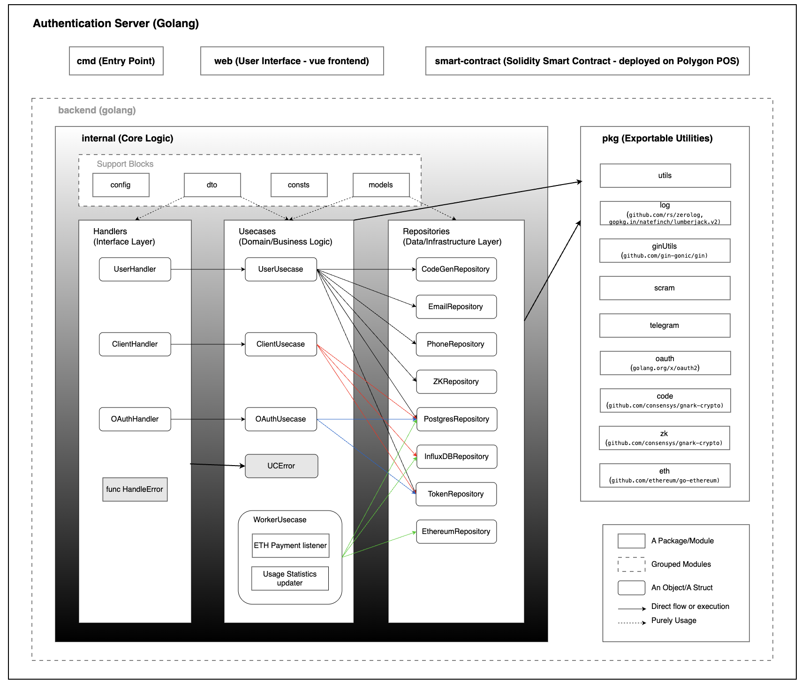
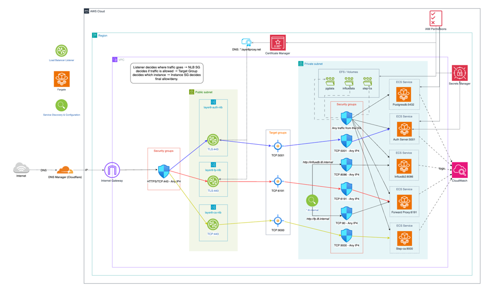
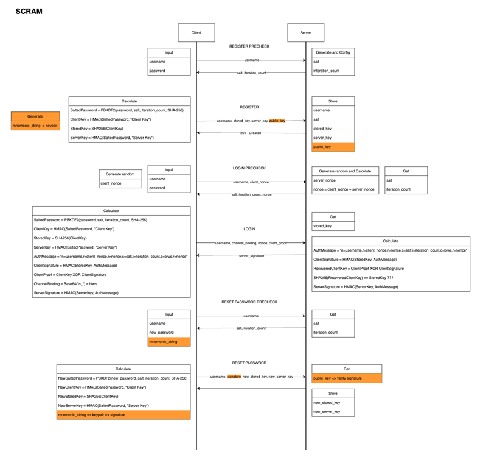
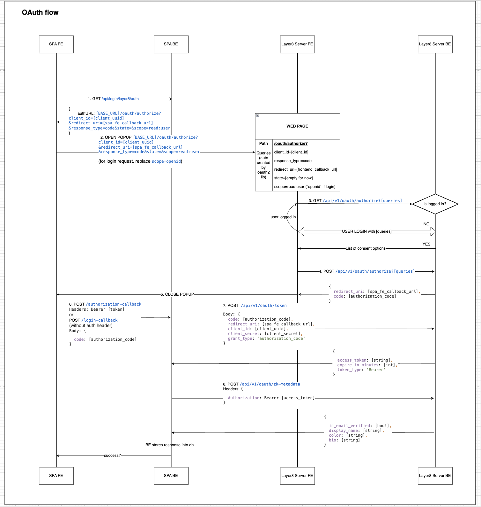
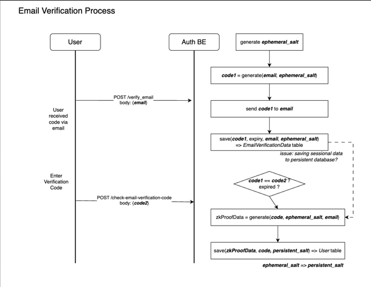
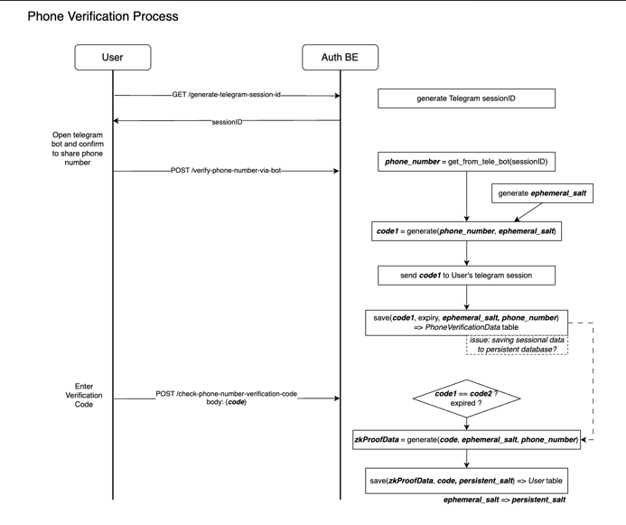

# Layer8 Authentication Server

- **Repository:** https://github.com/globe-and-citizen/layer8-auth-server
- **Default branch:** `main`
- **Primary language:** Go (repo is mixed: Go + Vue + CSS/TS)
- **Last updated:** 2026-04-30 (per repo metadata)
  <br>

### Table of contents:

- [1. Overview](#1-overview)
- [2. Technology Stack](#2-technology-stack)
    - [2.1. Backend (Go)](#21-backend-go)
    - [2.2. Frontend (Vue/Vite)](#22-frontend-vuevite)
    - [2.3. Smart contracts (Hardhat)](#23-smart-contracts-hardhat)
- [3. Configuration](#3-configuration)
    - [3.1 Core App](#31-core-app)
    - [3.2 Security / Crypto](#32-security--crypto)
    - [3.3 Logging](#33-logging)
    - [3.4 SPA / Frontend config served by backend](#34-spa--frontend-config-served-by-backend)
    - [3.5 PostgreSQL](#35-postgresql)
    - [3.6 User auth & verification](#36-user-auth--verification)
    - [3.7 Client auth / billing](#37-client-auth--billing)
    - [3.8 InfluxDB 2](#38-influxdb-2)
    - [3.9 Web3 / Ethereum](#39-web3--ethereum)
    - [3.10 OAuth server config](#310-oauth-server-config)
- [4. Deployment](#4-deployment)
- [5. Project Structure](#5-project-structure)
    - [5.1. Top-level layout](#51-top-level-layout)
    - [5.2. Request flow (how code is intended to be read)](#52-request-flow-how-code-is-intended-to-be-read)
- [6. API Endpoints and Background Workers](#6-api-endpoints-and-background-workers)
    - [6.1 System / Public](#61-system--public)
    - [6.2 User APIs](#62-user-apis-internalhandlersuserhinitgo)
    - [6.3 Client APIs](#63-client-apis-internalhandlersclienthinitgo)
    - [6.4 OAuth APIs](#64-oauth-apis-internalhandlersoauthhinitgo)
    - [6.5. Background workers](#65-background-workers-internalusecasesworkerucinitgo---non-http)
- [7. Logical flows](#7-logical-flows)
    - [7.1. Registration and Login with SCRAM password hashing](#71-registration-and-login-with-scram-password-hashing)
    - [7.2. Authorization code flow with OAuth2 and OIDC extensions](#72-authorization-code-flow-with-oauth2-and-oidc-extensions)
    - [7.3. Email and phone verification using Zero-Knowledge Proofs](#73-email-and-phone-verification-using-zero-knowledge-proofs)
- [8. Data Dictionary](#8-data-dictionary)
  - [8.1. Persistent Data Models](#81-persistent-data-models)
  - [8.2. Token Claims](#82-token-claims)
  - [8.3. API Request Payloads](#83-api-request-payloads)
  - [8.4. API Response Payloads](#84-api-response-payloads)
  - [8.5. Relationships](#85-relationships)

<br>

## 1. Overview

The Layer8 auth-server is a control-plane service that governs identity, authorization, and metering for the Layer8
network. While Layer8’s forward/reverse proxies and interceptor handle data-plane traffic, the auth-server handles who
is allowed to use the system, what they are allowed to do, and how usage is accounted for. It issues tokens used by
other components, stores canonical user/client state in Postgres, and maintains usage/billing state via InfluxDB and
Web3 payment events.

### 1.1. User interface portals (SPA)

The repository bundles a Vue (Vite) single-page application that provides these portals:

- **Welcome / Landing portal**
    - Entry screen for navigation into user/client/oauth flows.

- **User Portal**
    - User registration
    - User login
    - Reset password
    - Profile page
    - Email verification
    - Phone verification (Telegram-assisted)

- **Client Portal**
    - Client registration
    - Client login
    - Client profile page (usage/billing-related UI as implemented)

- **OAuth Portal**
    - OAuth login
    - OAuth consent/authorize screen
    - OAuth error screen (human-readable mapping of OAuth errors)

### 1.2. Key features

- **User identity & access**
    - User registration, login, password reset
    - Profile and metadata management
    - Email and phone verification (including Telegram-based phone verification)

- **Client identity & access**
    - Client registration and login
    - Client profile retrieval
    - Certificate upload and retrieval endpoints for external components (e.g., forward proxy integration)

- **OAuth authorization server**
    - `/authorize` and `/token` flows (authorization code grant)
    - User consent UI support via the bundled SPA
    - Optional ZK-backed metadata sharing endpoints

- **Zero-knowledge (ZK) verification support**
    - Generates and stores ZK proofs tied to verified attributes (e.g., email/phone verification), enabling
      privacy-preserving attribute sharing.

- **Usage metering & billing**
    - Reads usage statistics from **InfluxDB** (time-series)
    - Periodic worker updates client balances based on usage and configured billing rate

- **Web3 / payment integration**
    - Connects to Ethereum-compatible networks via WebSocket RPC
    - Listens for contract events to reconcile payment-related state
    - Packages smart contract ABI artifacts into the runtime image for contract interaction

### 1.3. Main components

- **Go backend (Gin)**
    - REST APIs under `/api/v1`
    - Auth middleware for user, client, and OAuth flows
    - Serves static SPA assets and a runtime `config.js`

- **PostgreSQL (state store)**
    - Users, clients, OAuth authorization codes
    - Verification data and metadata
    - Client balances and payment receipts

- **InfluxDB 2 (metering store)**
    - Time-series measurements for client usage (e.g., transferred bytes)
    - Used for usage statistics endpoints and periodic billing updates

- **Vue SPA frontend**
    - User portal and client portal screens

<br>
*Figure 1. High-level architecture of the Layer8 Authentication Server*

<br>

## 2. Technology Stack

### 2.1. Backend (Go)

Key Go dependencies (from `go.mod`):

- **HTTP / API:** `github.com/gin-gonic/gin`, `github.com/gin-contrib/cors`
- **Auth / JWT:** `github.com/golang-jwt/jwt/v5`
- **OAuth2:** `golang.org/x/oauth2`
- **Database:** `gorm.io/gorm`, `gorm.io/driver/postgres`
- **Time-series:** `github.com/influxdata/influxdb-client-go/v2`
- **Config:** `github.com/caarlos0/env/v11`, `github.com/joho/godotenv`
- **Logging:** `github.com/rs/zerolog` + `lumberjack` (log rotation)
- **Blockchain:** `github.com/ethereum/go-ethereum`
- **Zero-knowledge:** `github.com/consensys/gnark`, `gnark-crypto`
<br>

### 2.2. Frontend (Vue/Vite)

Built in Docker multi-stage (`node:20-alpine`) and copied into runtime image as `/app/web/dist`.

<br>

### 2.3. Smart contracts (Hardhat)

`smart-contract/Readme.md` indicates:

- Install Hardhat + toolbox
- `npx hardhat compile`
- Deploy example: `npx hardhat run scripts/deploy.ts --network sepolia`

<br>

## 3. Configuration

Source of truth:

- `.env.dev`, `.env.docker`
- Go structs in `internal/config/*` and `pkg/log`, `pkg/utils`

### 3.1 Core App

| Name          | Meaning                               | Example                   | Required |
|---------------|---------------------------------------|---------------------------|----------|
| `APP_ENV`     | App environment label                 | `development`             | Yes      |
| `SERVER_HOST` | Bind host                             | `localhost`               | No       |
| `SERVER_PORT` | Bind port                             | `5001`                    | No       |
| `SERVER_DNS`  | Public/base DNS used for tokens/links | `https://layer8proxy.net` | No       |

<br>

### 3.2 Security / Crypto

| Name                          | Meaning                           | Example | Required          |
|-------------------------------|-----------------------------------|---------|-------------------|
| `SCRAM_ITERATION_COUNT`       | SCRAM password hashing iterations | `4096`  | No (default 4096) |
| `GENERATE_NEW_ZK_SNARKS_KEYS` | Regenerate ZK keys on startup     | `true`  | No (default true) |

<br>

### 3.3 Logging

| Name            | Meaning                    | Example                   | Required                  |
|-----------------|----------------------------|---------------------------|---------------------------|
| `LOG_LEVEL`     | Log level                  | `info`                    | No (default info)         |
| `LOG_FORMAT`    | `json` or `text`           | `json`                    | No                        |
| `LOG_OUTPUT`    | `stdout` or `file`         | `stdout`                  | No                        |
| `LOG_FILE_PATH` | Path used when output=file | `./tmp/layer8-server.log` | Only if `LOG_OUTPUT=file` |

<br>

### 3.4 SPA / Frontend config served by backend

| Name                 | Meaning                           | Example                 | Required                                 |
|----------------------|-----------------------------------|-------------------------|------------------------------------------|
| `STATIC_ASSETS_PATH` | Where compiled assets live        | `./web/dist/assets`     | No (has default)                         |
| `SPA_INDEX_PATH`     | SPA index.html file               | `./web/dist/index.html` | Yes (required in struct but has default) |
| `BASE_API_URL`       | Base API URL exposed to frontend  | `http://localhost:5001` | No                                       |
| `CONTRACT_ADDRESS`   | Web3 contract address used by SPA | `0xba7A...`             | Yes                                      |
| `WALLET_PROJECT_ID`  | Wallet provider project id        | `f2fa...`               | Yes                                      |

<br>

### 3.5 PostgreSQL

| Name              | Meaning        | Example        | Required                                                                                       |
|-------------------|----------------|----------------|------------------------------------------------------------------------------------------------|
| `DB_HOST`         | Postgres host  | `localhost`    | No (default localhost)                                                                         |
| `DB_PORT`         | Postgres port  | `5432`         | No (default 5432)                                                                              |
| `DB_USER`         | Username       | `layer8`       | Yes                                                                                            |
| `DB_PASSWORD`     | Password       | `...`          | Yes                                                                                            |
| `DB_NAME`         | Database name  | `layer8db`     | Yes                                                                                            |
| `DB_SSL_MODE`     | SSL mode       | `disable`      | **Marked required** in struct, but DSN currently hardcodes `sslmode=disable` (needs alignment) |
| `DB_MIGRATE_PATH` | Migration path | `./migrations` | No                                                                                             |

<br>

### 3.6 User auth & verification

| Name                             | Meaning                            | Example           | Required                                          |
|----------------------------------|------------------------------------|-------------------|---------------------------------------------------|
| `USER_JWT_SECRET`                | JWT signing secret for user tokens | `...`             | Yes                                               |
| `MAILER_SEND_API_KEY`            | MailerSend API key                 | `...`             | Optional (required if email verification enabled) |
| `MAILER_SEND_TEMPLATE_ID`        | MailerSend template id             | `...`             | Optional                                          |
| `LAYER8_EMAIL_USERNAME`          | Sender username                    | `no-reply`        | Optional                                          |
| `LAYER8_EMAIL_DOMAIN`            | Sender domain                      | `layer8proxy.net` | Optional                                          |
| `EMAIL_VERIFICATION_CODE_EXPIRY` | Code TTL                           | `5m`              | No (default differs in code vs env files)         |
| `TELEGRAM_API_KEY`               | Telegram bot API key               | `...`             | Optional (required if phone verification enabled) |
| `PHONE_VERIFICATION_CODE_EXPIRY` | Code TTL                           | `5m`              | No                                                |

<br>

### 3.7 Client auth / billing

| Name                    | Meaning                                 | Example  | Required |
|-------------------------|-----------------------------------------|----------|----------|
| `CLIENT_JWT_SECRET`     | JWT signing secret for client tokens    | `...`    | Yes      |
| `UPDATE_USAGE_INTERVAL` | Worker interval to update usage/balance | `30s`    | No       |
| `BILLING_RATE_PER_BYTE` | Rate multiplier for billing             | `100000` | No       |

<br>

### 3.8 InfluxDB 2

| Name                | Meaning          | Example                     | Required                       |
|---------------------|------------------|-----------------------------|--------------------------------|
| `INFLUXDB_URL`      | Influx base URL  | `http://localhost:8086`     | No                             |
| `INFLUXDB_USERNAME` | Influx username  | `admin`                     | No                             |
| `INFLUXDB_PASSWORD` | Influx password  | `...`                       | No                             |
| `INFLUXDB_ORG`      | Influx org       | `layer8`                    | No                             |
| `INFLUXDB_BUCKET`   | Influx bucket    | `layer8`                    | No                             |
| `INFLUXDB_TOKEN`    | Influx API token | `DEFAULT_TOKEN_FOR_TESTING` | No (but required for real use) |

<br>

### 3.9 Web3 / Ethereum

| Name                            | Meaning                  | Example                                      | Required |
|---------------------------------|--------------------------|----------------------------------------------|----------|
| `WEB3_WS_RPC_URL`               | WebSocket RPC endpoint   | `wss://polygon-mainnet...`                   | Yes      |
| `WEB3_PAYMENT_CONTRACT_ADDRESS` | Payment contract address | `0xba7A...`                                  | Yes      |
| `WEB3_PAYMENT_CONTRACT_ABI`     | Path to ABI JSON         | `./smart-contract/abi/L8TrafficPayment.json` | Yes      |

<br>

### 3.10 OAuth server config

| Name                        | Meaning                                    | Example | Required                   |
|-----------------------------|--------------------------------------------|---------|----------------------------|
| `OAUTH_COOKIE_MAX_AGE`      | Cookie max age (seconds)                   | `3600`  | No (default 3600)          |
| `OAUTH_JWT_SECRET`          | JWT secret for OAuth sessions              | `...`   | Yes                        |
| `OAUTH_ACCESS_TOKEN_SECRET` | Secret for access token signing/encryption | `...`   | Yes                        |
| `OAUTH_AUTHZ_CODE_SECRET`   | Secret for authorization code protection   | `...`   | Yes                        |
| `OAUTH_AUTHZ_CODE_EXPIRY`   | Authorization code TTL                     | `10m`   | No                         |
| `OAUTH_ACCESS_TOKEN_EXPIRY` | Access token TTL                           | `1h`    | Yes (no default in struct) |
| `OAUTH_ID_TOKEN_SECRET`     | OIDC ID token secret                       | `...`   | Yes                        |
| `OAUTH_ID_TOKEN_EXPIRY`     | ID token TTL                               | `10m`   | Yes (no default in struct) |

<br>

### 3.11 Frontend-only env (Vite)

In `web/.env.dev`:

- `VITE_BASE_API_URL`
- `VITE_CONTRACT_ADDRESS`
- `VITE_WALLET_PROJECT_ID`

In `smart-contract/.env.dev`:

- `SEPOLIA_RPC_URL`, `POLYGON_RPC_URL`, `DEPLOYER_PRIVATE_KEY`, `RECEIVER_ADDRESS`

<br>

## 4. Deployment

The auth-server is designed to be deployed as a containerized service. The repository includes a `Dockerfile` that
builds the Go backend and Vue frontend into a single image, and a `docker-compose.yml` for local development with
Postgres and InfluxDB.
For production deployment, the image can be built and pushed to a container registry, then deployed on a platform of
choice (e.g., Kubernetes, AWS ECS, etc.) with appropriate environment variables and secrets management.

<br>
*Figure 2. Current Deployment architecture*

<br>

## 5. Project Structure

This repository follows a Clean-Architecture-style separation:

- **internal/** contains the core application code, organized by layer (handlers, usecases, repositories) and domain (
  user, client, oauth).
    - **Handlers** (HTTP layer) accept/validate requests and return responses.
    - **Usecases** implement business logic and orchestration.
    - **Repositories** encapsulate persistence and external service IO.
    - **Models/DTOs** define data structures across layers.
- **pkg/** contains shared utilities (reusable outside `internal/`).
- **web/** contains the SPA frontend built with Vite/Vue.
- **smart-contract/** contains Solidity/Hardhat code and ABI artifacts consumed at runtime.

### 5.1. Top-level layout

```text
layer8-auth-server/
├── cmd/
│   └── server/
│       └── main.go               # Application entry point; wires dependencies, registers routes, starts server
├── internal/                     # Private application code (not intended for external import)
│   ├── config/                   # Env/config structs + loader
│   ├── consts/                   # Global constants and error codes
│   ├── dto/                      # API data contracts
│   │   ├── requestdto/           # Incoming request payload structs (and validation, where implemented)
│   │   └── responsedto/          # Outgoing response payload structs
│   ├── handlers/                 # HTTP handlers/controllers (Gin)
│   │   ├── userH/                # User portal APIs
│   │   ├── clientH/              # Client portal APIs
│   │   └── oauthH/               # OAuth2/OIDC-style APIs
│   ├── models/
│   │   └── gormModels/           # Postgres schema models (GORM)
│   ├── repositories/             # Data access + external integrations
│   │   ├── postgresRepo/         # Postgres persistence logic (GORM)
│   │   ├── influxdbRepo/         # InfluxDB metrics/time-series queries
│   │   ├── tokenRepo/            # Token generation/verification
│   │   ├── emailRepo/            # Email provider integration (MailerSend)
│   │   ├── phoneRepo/            # Phone verification (Telegram bot flow)
│   │   ├── ethRepo/              # Ethereum/Web3 interaction
│   │   ├── codeGenRepo/          # OTP/verification code generation storage/logic
│   │   └── zkRepo/               # Zero-knowledge proof integration
│   └── usecases/                 # Business logic layer
│       ├── ucerror/              # Usecase error types mapped to HTTP errors
│       ├── userUC/               # User-related workflows
│       ├── clientUC/              # Client-related workflows
│       ├── oauthUC/              # OAuth workflows (authorize/token/etc)
│       └── workerUC/             # Background jobs (usage update, Ethereum event listening)
├── pkg/                          # Shared libraries/utilities (reusable, not app-private)
│   ├── ginUtils/                 # Gin middleware/helpers (request ID, access log, etc.)
│   ├── log/                      # Logging wrapper/config (zerolog + config)
│   ├── utils/                    # Generic helpers (includes DB connection helper)
│   ├── oauth/                    # OAuth primitives/helpers
│   ├── scram/                    # SCRAM password hashing implementation
│   ├── eth/                      # Low-level Ethereum client helpers
│   ├── zk/                       # ZK primitives/helpers
│   └── telegram/                 # Telegram bot client helpers
├── web/                          # Vue + Vite SPA frontend
│   ├── src/router/               # Client-side routes
│   └── src/views/                # Screens for user/client/oauth flows
├── smart-contract/               # Solidity/Hardhat project
│   └── abi/                      # ABI JSON artifacts copied into runtime image
├── docs/                         # Additional documentation (architecture diagrams, etc.)
├── Dockerfile                    # Multi-stage build (web + go) into distroless runtime
├── docker-compose.yml            # Local stack: server + postgres + influxdb2
├── .env.dev                      # Local dev env (server)
├── .env.docker                   # Docker env (server container)
├── go.mod / go.sum               # Go dependencies
└── Readme.md                     # (Currently mostly structure notes)
```

<br>

### 5.2. Request flow (how code is intended to be read)

Typical path for an API call:

1. `cmd/server/main.go` registers routes under `/api/v1`
2. `internal/handlers/*` parses request + applies auth middleware
3. `internal/usecases/*` performs business logic
4. `internal/repositories/*` talks to Postgres/Influx/Web3/Email/SMS/etc
5. `internal/dto/*` and `internal/models/*` define request/response and persistence shapes

This separation keeps HTTP concerns out of usecases and keeps IO behind repository interfaces.

<br>

## 6. API Endpoints and Background Workers

**Base path:** `/api/v1` (registered in `cmd/server/main.go`)

### 6.1 System / Public

| Route          | Method | Auth required | Request DTO | Response DTO         | Notes                   |
|----------------|-------:|---------------|-------------|----------------------|-------------------------|
| `/health`      |    GET | No            | —           | JSON `{status:"ok"}` | Service health check    |
| `/config.js`   |    GET | No            | —           | JS payload           | Frontend runtime config |
| `/assets/*`    |    GET | No            | —           | static               | Frontend assets         |
| `/*` (NoRoute) |    GET | No            | —           | `index.html`         | SPA fallback routing    |

<br>

### 6.2 User APIs (`internal/handlers/userH/init.go`)

All paths below are **under** `/api/v1`.

#### Unauthenticated

| Route                           | Method | Auth required | Request DTO                                | Response DTO             | Notes                      |
|---------------------------------|-------:|---------------|--------------------------------------------|--------------------------|----------------------------|
| `/user-register-precheck`       |   POST | No            | (likely) `requestdto.UserRegisterPrecheck` | (likely) `responsedto.*` | SCRAM/register precheck    |
| `/user-register`                |   POST | No            | `requestdto.UserRegister`                  | `responsedto.*`          | Create user                |
| `/user-login-precheck`          |   POST | No            | `requestdto.UserLoginPrecheck`             | `responsedto.*`          | SCRAM/login precheck       |
| `/user-login`                   |   POST | No            | `requestdto.UserLogin`                     | `responsedto.*`          | Login and set token/cookie |
| `/user-reset-password-precheck` |   POST | No            | `requestdto.UserResetPasswordPrecheck`     | `responsedto.*`          | Reset precheck             |
| `/user-reset-password`          |   POST | No            | `requestdto.UserResetPassword`             | `responsedto.*`          | Reset password             |

<br>

#### Authenticated (`/user/*`, middleware: `AuthenticateUser`)

| Route                                        | Method | Auth required           | Request DTO                                 | Response DTO                       | Notes                                |
|----------------------------------------------|-------:|-------------------------|---------------------------------------------|------------------------------------|--------------------------------------|
| `/user/profile`                              |    GET | Yes (user token/cookie) | —                                           | `responsedto.UserProfile` (likely) | Get current user profile             |
| `/user/update-metadata`                      |   POST | Yes                     | `requestdto.UserUpdateMetadata` (likely)    | `responsedto.*`                    | Update display name/bio/etc          |
| `/user/verify-email`                         |   POST | Yes                     | `requestdto.UserVerifyEmail` (likely)       | `responsedto.*`                    | Sends email verification code        |
| `/user/check-email-verification-code`        |   POST | Yes                     | `requestdto.UserCheckEmailVerificationCode` | `responsedto.*`                    | Confirms code, stores ZK proof       |
| `/user/verify-phone-number-via-bot`          |   POST | Yes                     | — / `requestdto.*`                          | `responsedto.*`                    | Uses Telegram bot flow               |
| `/user/check-phone-number-verification-code` |   POST | Yes                     | `requestdto.UserCheckPhoneVerificationCode` | `responsedto.*`                    | Confirms phone code, stores ZK proof |
| `/user/generate-telegram-session-id`         |    GET | Yes                     | —                                           | `responsedto.*`                    | Used to link Telegram session        |

<br>

### 6.3 Client APIs (`internal/handlers/clientH/init.go`)

All paths below are **under** `/api/v1`.

#### Unauthenticated

| Route                       | Method | Auth required | Request DTO                         | Response DTO                         | Notes                        |
|-----------------------------|-------:|---------------|-------------------------------------|--------------------------------------|------------------------------|
| `/check-backend-uri`        |   POST | No            | `requestdto.ClientCheckBackendURI`  | `responsedto.*`                      | Validates client backend URL |
| `/client-register-precheck` |   POST | No            | `requestdto.ClientRegisterPrecheck` | `responsedto.ClientRegisterPrecheck` | SCRAM/register precheck      |
| `/client-register`          |   POST | No            | `requestdto.ClientRegister`         | `responsedto.*`                      | Create client credentials    |
| `/client-login-precheck`    |   POST | No            | `requestdto.ClientLoginPrecheck`    | `responsedto.*`                      | SCRAM/login precheck         |
| `/client-login`             |   POST | No            | `requestdto.ClientLogin`            | `responsedto.ClientLogin`            | Login                        |

<br>

#### Authenticated (`/client/*`, middleware: `MdwAuthenticateClient`)

| Route                        | Method | Auth required      | Request DTO                              | Response DTO                       | Notes                         |
|------------------------------|-------:|--------------------|------------------------------------------|------------------------------------|-------------------------------|
| `/client/profile`            |    GET | Yes (client token) | —                                        | `responsedto.ClientProfile`        |                               |
| `/client/usage-stats`        |    GET | Yes                | —                                        | `responsedto.ClientUsageStatistic` | Uses InfluxDB                 |
| `/client/unpaid-amount`      |    GET | Yes                | —                                        | `responsedto.ClientGetBalance`     | Likely based on usage balance |
| `/client/upload-certificate` |   POST | Yes                | `requestdto.ClientUploadNTorCertificate` | `responsedto.*`                    | Stores NTor cert              |

<br>

#### External integration (`/ext/*`)

| Route              | Method | Auth required            | Request DTO                           | Response DTO                           | Notes             |
|--------------------|-------:|--------------------------|---------------------------------------|----------------------------------------|-------------------|
| `/ext/client-cert` |    GET | Yes (forward-proxy auth) | `requestdto.ClientGetNTorCertificate` | `responsedto.ClientGetNTorCertificate` | For forward proxy |

<br>

### 6.4 OAuth APIs (`internal/handlers/oauthH/init.go`)

All paths below are **under** `/api/v1`.

| Route                   | Method | Auth required | Request DTO    | Response DTO    | Notes                            |
|-------------------------|-------:|---------------|----------------|-----------------|----------------------------------|
| `/oauth-login-precheck` |   POST | No            | `requestdto.*` | `responsedto.*` | user login precheck (OAuth flow) |
| `/oauth-login`          |   POST | No            | `requestdto.*` | `responsedto.*` | user login for OAuth             |

<br>

OAuth group: `/oauth/*`

| Route                | Method | Auth required                  | Request DTO                           | Response DTO       | Notes                                         |
|----------------------|--------|--------------------------------|---------------------------------------|--------------------|-----------------------------------------------|
| `/oauth/authorize`   | GET    | Yes (OAuth user session)       | query params                          | JSON context       | Returns consent context (client name, scopes) |
| `/oauth/authorize`   | POST   | Yes (OAuth user session)       | JSON (consent decision)               | JSON redirect info | Used by SPA consent screen                    |
| `/oauth/token`       | POST   | Client auth (client_id/secret) | `requestdto.OAuthTokenRequest` (form) | token JSON         | `application/x-www-form-urlencoded`           |
| `/oauth/zk-metadata` | POST   | Yes (client auth)              | `requestdto.*`                        | `responsedto.*`    | returns ZK-backed metadata                    |

<br>

### 6.5. Background workers (`internal/usecases/workerUC/init.go` - non-HTTP)

In addition to HTTP endpoints, the auth-server runs **background workers** started from `cmd/server/main.go` that
perform periodic and event-driven tasks:

- **Usage balance updater (periodic)**
    - **Trigger:** `time.NewTicker(appConfig.UpdateUsageInterval)`
    - **Purpose:** periodically updates client usage/balance based on metering data (InfluxDB) and billing rate.
    - **Entry point:** `workerUsecase.UpdateUsageBalance(appConfig.BillingRatePerByte, currTime)`
    - **Config:**
        - `UPDATE_USAGE_INTERVAL` (e.g., `30s`)
        - `BILLING_RATE_PER_BYTE` (e.g., `100000`)
    - **Dependencies:**
        - InfluxDB repository (`internal/repositories/influxdbRepo/*`) for usage data
        - Postgres repository (`internal/repositories/postgresRepo/*`) for persisting balances/receipts

- **Ethereum event listener (event-driven)**
    - **Trigger:** long-running goroutine
    - **Purpose:** listens for on-chain payment/contract events to update client payment state.
    - **Entry point:** `workerUsecase.ListenToEthereumEvents()`
    - **Config:**
        - `WEB3_WS_RPC_URL`
        - `WEB3_PAYMENT_CONTRACT_ADDRESS`
        - `WEB3_PAYMENT_CONTRACT_ABI`
    - **Dependencies:**
        - Ethereum repository (`internal/repositories/ethRepo/*`)
        - Web3 helpers (`pkg/eth/*`)
        - Postgres models such as `client_balance` / `client_payment_receipt`

<br>

## 7. Logical flows

### 7.1. Registration and Login with SCRAM password hashing

<br>
*Figure 3. User registration/login flow with SCRAM precheck and hashing*

<br>

### 7.2. Authorization code flow with OAuth2 and OIDC extensions

<br>
*Figure 4. Authorization code flow with OAuth2*

<br>

### 7.3. Email and phone verification using Zero-Knowledge Proofs

<br>
*Figure 5. ZK-based email verification flow*

<br>

<br>
*Figure 6. ZK-based phone number verification flow*

<br>

## 8. Data Dictionary

### 8.1. Persistent Data Models

#### `users`

| Field                      | Type   | Required | Description                         |
|----------------------------|--------|---------:|-------------------------------------|
| `id`                       | uint   |      Yes | Primary key, auto-increment user ID |
| `username`                 | string |      Yes | Unique username                     |
| `email_salt`               | string |       No | Salt used for email ZK workflow     |
| `email_verification_code`  | string |       No | Stored email verification code      |
| `email_zk_proof`           | bytes  |       No | Email zero-knowledge proof          |
| `email_zk_id`              | uint   |       No | Reference to ZK key pair for email  |
| `phone_salt`               | string |       No | Salt used for phone ZK workflow     |
| `phone_verification_code`  | string |       No | Stored phone verification code      |
| `phone_zk_proof`           | bytes  |       No | Phone zero-knowledge proof          |
| `phone_zk_id`              | uint   |       No | Reference to ZK key pair for phone  |
| `public_key`               | bytes  |       No | User public key                     |
| `salt`                     | string |       No | SCRAM salt                          |
| `iteration_count`          | int    |       No | SCRAM iteration count               |
| `server_key`               | string |       No | SCRAM server key                    |
| `stored_key`               | string |       No | SCRAM stored key                    |
| `telegram_session_id_hash` | bytes  |       No | Hashed Telegram session ID          |
<br>

#### `clients`

| Field                    | Type   | Required | Description                            |
|--------------------------|--------|---------:|----------------------------------------|
| `id`                     | string |      Yes | Client identifier                      |
| `secret`                 | string |       No | Client secret                          |
| `name`                   | string |       No | Client display/application name        |
| `redirect_uri`           | string |       No | OAuth redirect URI                     |
| `backend_uri`            | string |       No | Backend URI associated with the client |
| `username`               | string |      Yes | Unique client username                 |
| `salt`                   | string |      Yes | SCRAM salt                             |
| `iteration_count`        | int    |       No | SCRAM iteration count                  |
| `server_key`             | string |       No | SCRAM server key                       |
| `stored_key`             | string |       No | SCRAM stored key                       |
| `x509_certificate_bytes` | bytes  |       No | NTor/X509 certificate bytes            |
<br>

#### `oauth_authorization_codes`

| Field          | Type     | Required | Description                    |
|----------------|----------|---------:|--------------------------------|
| `id`           | uint     |      Yes | Primary key                    |
| `code`         | string   |      Yes | Unique authorization code      |
| `client_id`    | string   |      Yes | OAuth client ID                |
| `user_id`      | uint     |      Yes | Authorized user ID             |
| `redirect_uri` | string   |      Yes | Redirect URI bound to the code |
| `scopes`       | string   |      Yes | Approved scopes                |
| `nonce`        | string   |       No | OIDC nonce                     |
| `expires_at`   | int64    |      Yes | Expiry timestamp               |
| `created_at`   | datetime |     Auto | Creation timestamp             |
<br>

#### `email_verification_data`

| Field               | Type     | Required | Description                    |
|---------------------|----------|---------:|--------------------------------|
| `id`                | uint     |      Yes | Primary key                    |
| `user_id`           | uint     |      Yes | Unique user reference          |
| `salt`              | string   |      Yes | Salt for verification workflow |
| `email`             | string   |      Yes | Email being verified           |
| `verification_code` | string   |      Yes | Verification code              |
| `expires_at`        | datetime |      Yes | Expiration time                |
<br>

#### `phone_number_verification_data`

| Field               | Type     | Required | Description                    |
|---------------------|----------|---------:|--------------------------------|
| `id`                | uint     |      Yes | Primary key                    |
| `user_id`           | uint     |      Yes | Unique user reference          |
| `salt`              | string   |      Yes | Salt for verification workflow |
| `phone_number`      | string   |      Yes | Phone number being verified    |
| `verification_code` | string   |      Yes | Verification code              |
| `expires_at`        | datetime |      Yes | Expiration time                |
<br>

#### `client_balance`

| Field                   | Type                   | Required | Description             |
|-------------------------|------------------------|---------:|-------------------------|
| `id`                    | uint                   |      Yes | Primary key             |
| `client_id`             | string                 |      Yes | Unique client reference |
| `balance_wei`           | string / numeric(78,0) |       No | Balance in wei          |
| `status`                | enum string            |       No | Account balance status  |
| `last_usage_updated_at` | datetime               |       No | Last usage update time  |

**Allowed values for `status`:**

- `owing`
- `zeroed`
- `overpaid`
<br>

#### `client_payment_receipt`

| Field             | Type                   | Required | Description               |
|-------------------|------------------------|---------:|---------------------------|
| `id`              | uint                   |      Yes | Primary key               |
| `client_id`       | string                 |      Yes | Client reference          |
| `paid_amount_wei` | string / numeric(78,0) |       No | Paid amount in wei        |
| `paid_at`         | datetime               |       No | Payment timestamp         |
| `tx_id`           | string                 |       No | Blockchain transaction ID |
<br>

#### `user_metadata`

| Field                      | Type     | Required | Description                                     |
|----------------------------|----------|---------:|-------------------------------------------------|
| `id`                       | uint     |      Yes | Primary key; likely user-linked metadata record |
| `display_name`             | string   |      Yes | Public display name                             |
| `color`                    | string   |      Yes | User-selected color                             |
| `bio`                      | string   |      Yes | User biography                                  |
| `is_email_verified`        | bool     |      Yes | Whether email is verified                       |
| `is_phone_number_verified` | bool     |      Yes | Whether phone number is verified                |
| `created_at`               | datetime |      Yes | Created timestamp                               |
| `updated_at`               | datetime |      Yes | Updated timestamp                               |
<br>

#### `zk_snarks_key_pairs`

| Field           | Type  | Required | Description      |
|-----------------|-------|---------:|------------------|
| `id`            | uint  |      Yes | Primary key      |
| `proving_key`   | bytes |      Yes | ZK proving key   |
| `verifying_key` | bytes |      Yes | ZK verifying key |

<br>

### 8.2. Token Claims

#### User JWT Claims

| Field             | Type                | Description                      |
|-------------------|---------------------|----------------------------------|
| `username`        | string              | Username in token                |
| `user_id`         | uint                | Internal user ID                 |
| registered claims | JWT standard fields | `exp`, `iat`, `iss`, `sub`, etc. |
<br>

#### Client JWT Claims

| Field             | Type                | Description                      |
|-------------------|---------------------|----------------------------------|
| `username`        | string              | Client username                  |
| `user_id`         | string              | Client ID                        |
| registered claims | JWT standard fields | `exp`, `iat`, `iss`, `sub`, etc. |
<br>

#### OAuth Access Token Claims

| Field             | Type                | Description         |
|-------------------|---------------------|---------------------|
| `user_id`         | uint                | Authorized user     |
| `scopes`          | string              | Granted scopes      |
| registered claims | JWT standard fields | Standard JWT claims |
<br>

#### OAuth ID Token Claims

| Field             | Type                | Description                             |
|-------------------|---------------------|-----------------------------------------|
| `auth_time`       | datetime            | Authentication time                     |
| `nonce`           | string              | OIDC nonce                              |
| `username`        | string              | Username                                |
| `display_name`    | string              | Display name                            |
| `bio`             | string              | User biography                          |
| registered claims | JWT standard fields | `iss`, `sub`, `aud`, `exp`, `iat`, etc. |
<br>

### 8.3. API Request Payloads

#### User Requests

- **`UserRegisterPrecheck`**

| Field      | Type   | Required | Validation     |
|------------|--------|---------:|----------------|
| `username` | string |      Yes | `min=3,max=50` |

- **`UserRegister`**

| Field        | Type     | Required | Description                      |
|--------------|----------|---------:|----------------------------------|
| `public_key` | bytes    |      Yes | User public key                  |
| `scram.*`    | embedded |      Yes | SCRAM registration final message |

- **`UserLogin`**

| Field     | Type     | Required | Description                      |
|-----------|----------|---------:|----------------------------------|
| `c_nonce` | string   |      Yes | Client nonce                     |
| `scram.*` | embedded |      Yes | SCRAM client login final message |

- **`UserMetadataUpdate`**

| Field          | Type   | Required |
|----------------|--------|---------:|
| `display_name` | string |       No |
| `color`        | string |       No |
| `bio`          | string |       No |

- **`UserEmailVerify`**

| Field   | Type   | Required | Validation |
|---------|--------|---------:|------------|
| `email` | string |      Yes | `email`    |

- **`UserCheckEmailVerificationCode`**

| Field  | Type   | Required |
|--------|--------|---------:|
| `code` | string |      Yes |

- **`UserCheckPhoneVerificationCode`**

| Field  | Type   | Required |
|--------|--------|---------:|
| `code` | string |      Yes |

<br>

#### Client Requests

- **`ClientRegister`**

| Field          | Type     | Required |
|----------------|----------|---------:|
| `name`         | string   |      Yes |
| `redirect_uri` | string   |      Yes |
| `backend_uri`  | string   |      Yes |
| `scram.*`      | embedded |      Yes |

- **`ClientLogin`**

| Field     | Type     | Required |
|-----------|----------|---------:|
| `c_nonce` | string   |      Yes |
| `scram.*` | embedded |      Yes |

- **`ClientCheckBackendURI`**

| Field         | Type   | Required |
|---------------|--------|---------:|
| `backend_uri` | string |      Yes |

- **`ClientUploadNTorCertificate`**

| Field         | Type   | Required |
|---------------|--------|---------:|
| `certificate` | string |      Yes |

<br>

#### OAuth Requests

- **`OAuthAuthorizeQueries`**

| Field           | Type   | Required | Description         |
|-----------------|--------|---------:|---------------------|
| `response_type` | string |      Yes | OAuth response type |
| `client_id`     | string |      Yes | OAuth client ID     |
| `redirect_uri`  | string |      Yes | Redirect URI        |
| `scopes`        | string |      Yes | Requested scopes    |
| `state`         | string |       No | Client state        |
| `nonce`         | string |       No | OIDC nonce          |

- **`OAuthAuthorizeConsent`**

| Field                     | Type | Required | Description                       |
|---------------------------|------|---------:|-----------------------------------|
| `oidc_agreed`             | bool |       No | Whether user agrees to OIDC share |
| `share.bio`               | bool |       No | Share bio                         |
| `share.color`             | bool |       No | Share color                       |
| `share.display_name`      | bool |       No | Share display name                |
| `share.is_email_verified` | bool |       No | Share email verification flag     |

- **`OAuthTokenRequest`**

| Field           | Type   | Required |
|-----------------|--------|---------:|
| `grant_type`    | string |      Yes |
| `client_id`     | string |      Yes |
| `client_secret` | string |      Yes |
| `code`          | string |      Yes |
| `redirect_uri`  | string |       No |

<br>

### 8.4. API Response Payloads

#### `UserProfile`

| Field                   | Type   |
|-------------------------|--------|
| `username`              | string |
| `display_name`          | string |
| `bio`                   | string |
| `color`                 | string |
| `email_verified`        | bool   |
| `phone_number_verified` | bool   |
<br>

#### `ClientProfile`

| Field              | Type   |
|--------------------|--------|
| `id`               | string |
| `secret`           | string |
| `name`             | string |
| `redirect_uri`     | string |
| `backend_uri`      | string |
| `ntor_certificate` | string |
<br>

#### `ClientGetBalance`

| Field     | Type   |
|-----------|--------|
| `balance` | string |
<br>

#### `OAuthTokenResponse`

| Field                | Type             |
|----------------------|------------------|
| `access_token`       | string           |
| `token_type`         | string           |
| `expires_in_minutes` | int              |
| `id_token`           | string, optional |
| `refresh_token`      | string, optional |
<br>

### 8.5. Relationships

- `users.id` -> `email_verification_data.user_id`
- `users.id` -> `phone_number_verification_data.user_id`
- `users.id` -> `oauth_authorization_codes.user_id`
- `clients.id` -> `oauth_authorization_codes.client_id`
- `clients.id` -> `client_balance.client_id`
- `clients.id` -> `client_payment_receipt.client_id`
- `users.email_zk_id` -> `zk_snarks_key_pairs.id`
- `users.phone_zk_id` -> `zk_snarks_key_pairs.id`