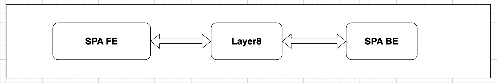
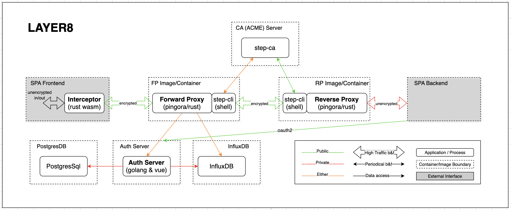
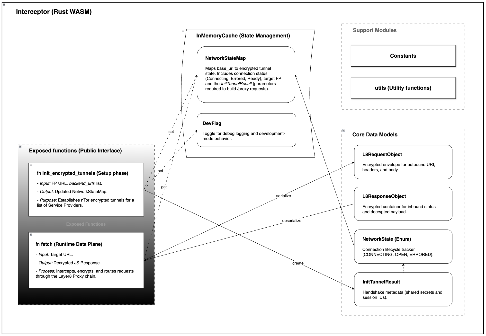
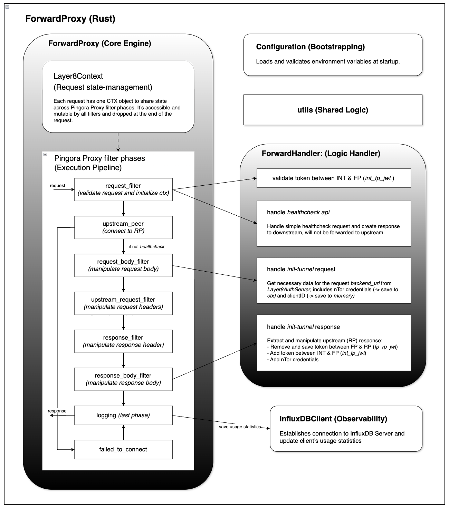
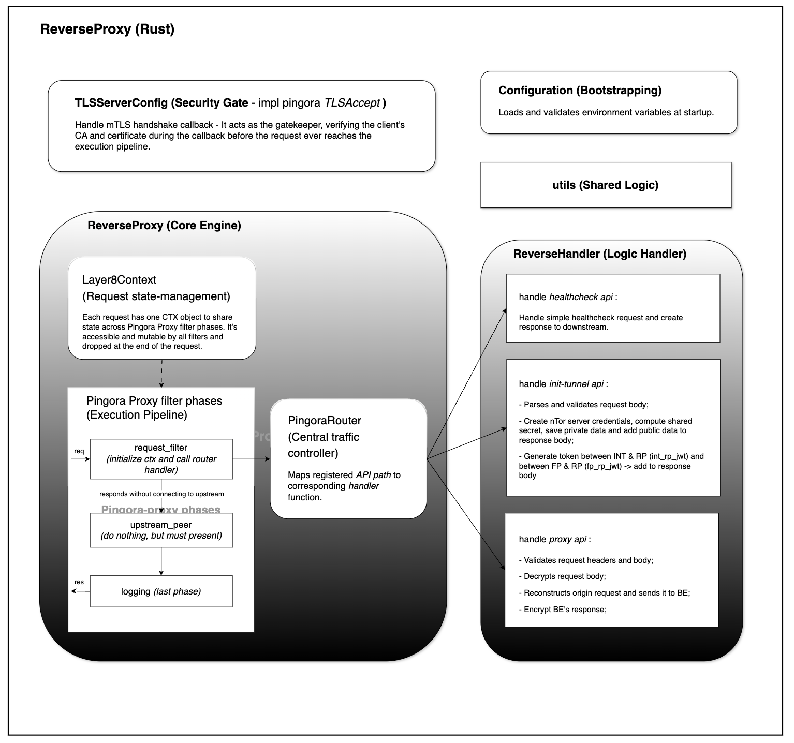
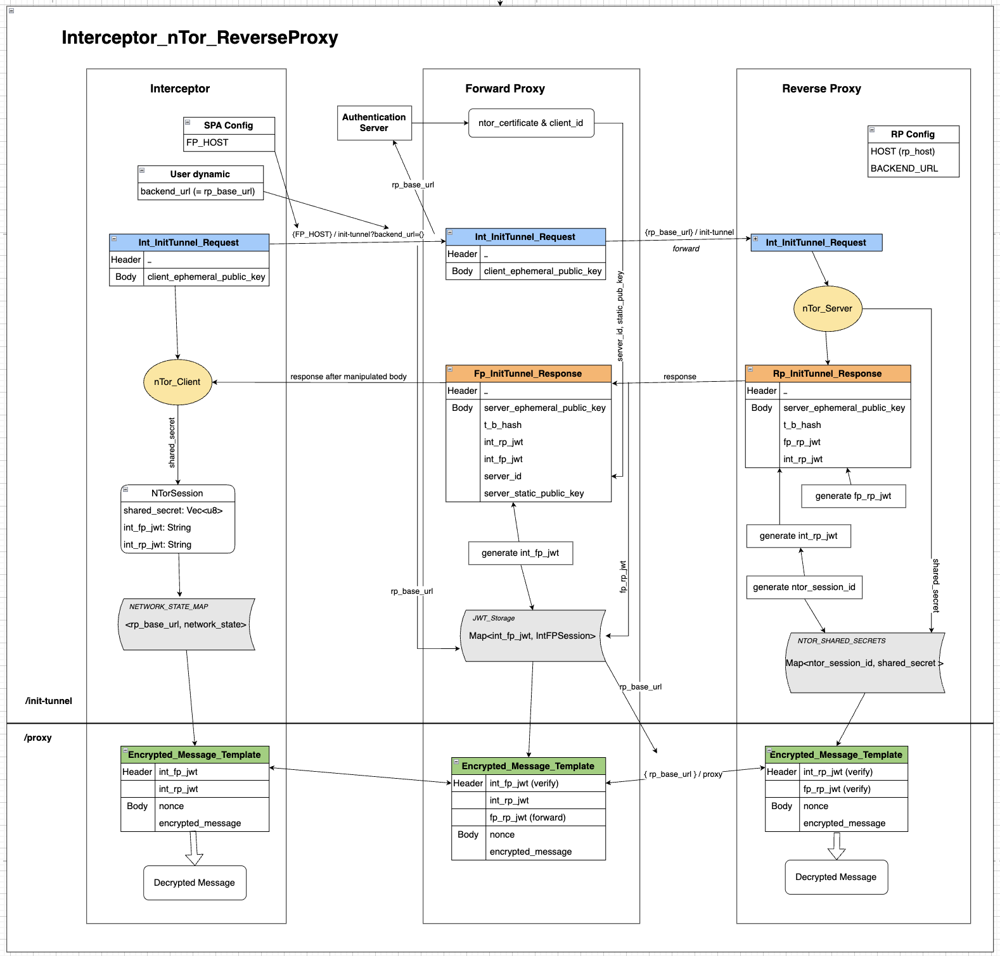
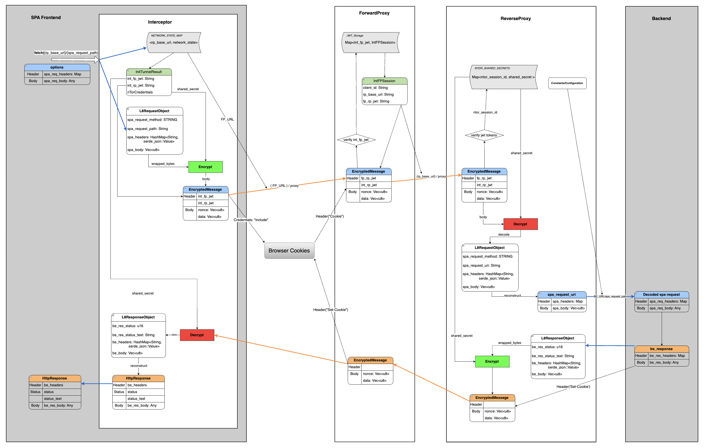

## Layer8 Architecture Diagrams (Draft)

### *Table of Contents*

[General Visualization Guidelines](#general-visualization-guidelines)  

1. [Overview](#1-overview) 
2. [Layer8 Infrastructure](#2-layer8-infrastructure) 
3. [Layer8 Core Components](#3-layer8-core-components) 
   3.1. [Interceptor](#31-interceptor) 
   3.2. [Forward Proxy](#32-forward-proxy) 
   3.3. [Reverse Proxy](#33-reverse-proxy) 
   3.4. [Authenticaiton Server](#34-authentication-server) 
4. [Logical Flows](#4-logical-flows) 
   4.1. [Init Tunnel Request](#41-init-encrypted-tunnel-request) 
   4.2. [Proxy Request](#42-proxy-request) 

### General Visualization Guidelines

- **Solid Boxes**: Represent functional units. Use these for active processes, specific modules, or core application
  logic that performs a task:
    - **Sharp (Square) Rectangles** a logical module, code unit, package, a function/method, etc.
    - **Rounded Rectangles**: an application, a process, an entity, an object, etc.
- **Dashed Boxes**: a collection of related items, such as components within a container, related libraries, modules,
  etc.
- **Grey Boxes**: external interface, systems or service outside the primary system control.
- **Gradient Boxes**: core component, the primary focus or "Main" driver of the architecture.
- **Pointed Boxes**: persistent storage.
- **Solid Lines**: direct flows, commands, primary paths, synchronous calls and etc.
- **Dashed Lines**: indirect flows,actions, dependencies, get/set, etc.
   
   

### 1. Overview

*Figure 1: High-Level System Architecture.*

This diagram illustrates the macro-level request flow where the Layer8 infrastructure acts as a transparent
intermediary, managing secure communication between the Single Page Application (SPA) Frontend and its corresponding
Backend services.

### 2. Layer8 Infrastructure

*Figure 2: Layer8 Component and Infrastructure Deployment.*
 

The diagram shows detailed view of the Layer8 ecosystem, highlighting the internal service boundaries (Forward and
Reverse Proxies), the automated ACME/step-ca certificate management pipeline, and integrated authentication services (
InfluxDB, Auth Server, and PostgreSQL).

### 3. Layer8 Core Components

#### 3.1. Interceptor

 

The below diagram outlines the high-level architecture and data flow of a Rust-based WebAssembly (WASM) Interceptor. It
illustrates the interaction between public-facing functions—specifically for tunnel initialization and runtime data
fetching—and the internal state management, data models, and support modules required to manage encrypted network
requests through a proxy chain.
 

*Figure 3: Rust-based WebAssembly (WASM) Interceptor*

 

**Key Components:**  
*Exposed Functions (Public Interface)*: Defines the entry points for the WASM module, including init_encrypted_tunnels
for the setup phase and a specialized fetch function for intercepting and routing data plane traffic.

*InMemoryCache (State Management)*: Acts as the central authority for tracking the lifecycle of network connections and
managing global flags like DevFlag for debugging.

*Core Data Models*: Illustrates the schema for request/response objects (e.g., L8RequestObject, L8ResponseObject) and
the state enums that track connection progress.

*Support Modules*: Contains shared utilities and constants used across the interceptor to maintain a clean separation of
concerns.

#### 3.2. Forward Proxy

**3.2.1. Architecture Overview:**

*Figure 4: Rust/Pingora based Forward Proxy*

 

This diagram illustrates the internal architecture and request lifecycle of a Rust-based Forward Proxy, specifically
highlighting its integration with the Pingora framework. It details the execution pipeline, state management, and
external observability services.

*ForwardProxy (Core Engine)*: The heart of the service, containing the Layer8Context for per-request state management
and the Pingora Proxy filter phases. This execution pipeline demonstrates the sequential flow of a request from initial
validation and peer connection to body manipulation and final logging.

*ForwardHandler (Logic Handler)*: A dedicated module that manages specific business logic, such as JWT token validation,
health check processing, and the complex handshake requirements for tunnel initialization (init-tunnel).

*Observability & Infrastructure*: Configuration (Bootstrapping): Handles environment variable loading and validation.

*InfluxDBClient*: An observability component that captures usage statistics from the logging phase to monitor proxy
performance and traffic.

*utils*: A shared library for common logic used across different modules.
 

#### 3.3. Reverse Proxy

*Figure 5: Rust/Pingora based Reverse Proxy*
 

#### 3.4. Authentication Server

*Figure 6: Architectural Component Plot (Clean Architecture)*

### 4. Logical Flows

#### 4.1. Init Encrypted Tunnel Request

*Figure 7: Process for establishing a secure encrypted tunnel between Layer8 components.*

 

This architectural diagram illustrates the end-to-end communication lifecycle of the Layer8 networking stack,
specifically detailing the interaction between the Interceptor, Forward Proxy, and Reverse Proxy. The flow is bifurcated
into two distinct operational phases: the Setup Phase (/init-tunnel), which utilizes an nTor-based handshake to
establish shared cryptographic secrets and distribute JWT-based authorization tokens. The (`/proxy` request) at the end
of the picture briefly describes how the output of `/init-tunnel` being used for the Runtime phase.

#### 4.2. Proxy Request

 
Below diagram describes the Runtime Phase (/proxy) of Layer8 protocol, where application-layer requests are encapsulated within encrypted message templates for secure transit. By decoupling the identity verification and key exchange from the actual data plane, the system ensures a zero-trust environment where each node in the chain validates session integrity without exposing the underlying plaintext traffic.
 

*Figure 8: Simulates a JavaScript **fetch** call, encrypting input data and transmitting it via a Layer8 encrypted
tunnel (`/proxy` request).*

#### 4.3. OAuth Flows

*Figure 9: OAuth 2.0 Authorization Code Flow*

 
This sequence diagram illustrates the OAuth 2.0 Authorization Code Flow integrated within the Layer8 ecosystem, facilitating secure, delegated access between the Third-Party SPA and the Layer8 Server. The process utilizes a Backend-for-Frontend (BFF) architecture, where the Single-Page Application (SPA) frontend initiates the handshake via a popup, but the sensitive exchange of the authorization code for an access token is handled exclusively by the SPA’s backend. This design ensures that the `client_secret` remains protected from browser-side exposure. The flow concludes with a specialized ZK-Metadata retrieval phase, leveraging the freshly minted Bearer token to fetch verified user attributes (such as email, status and bio) while maintaining the cryptographic integrity of the user's decentralized identity.

